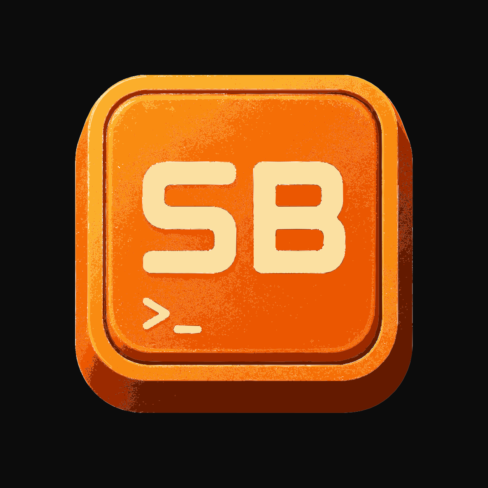
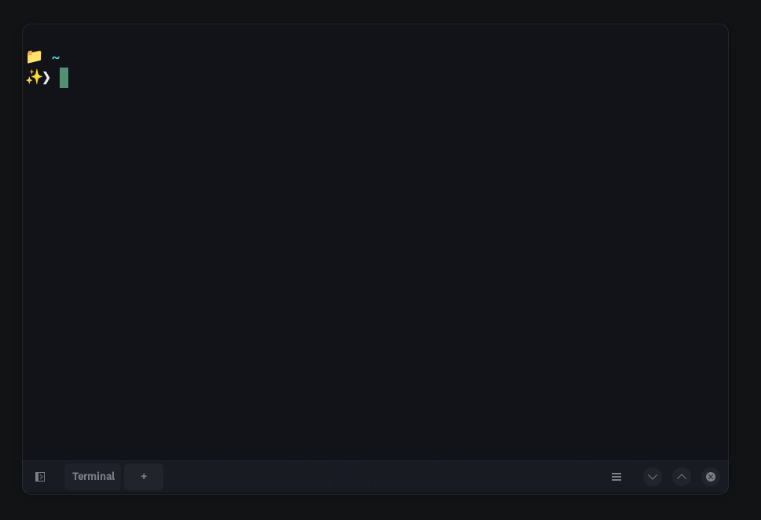
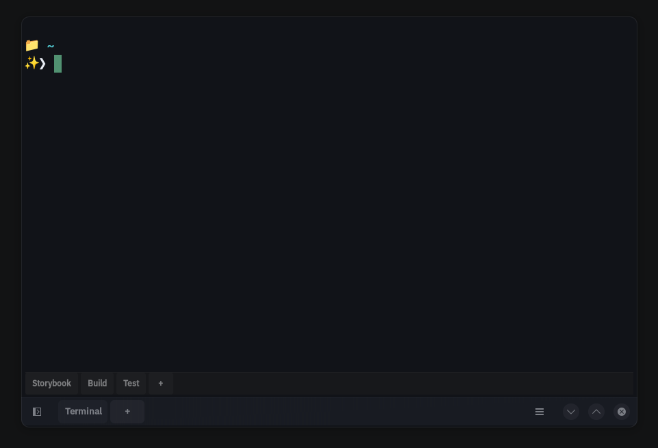
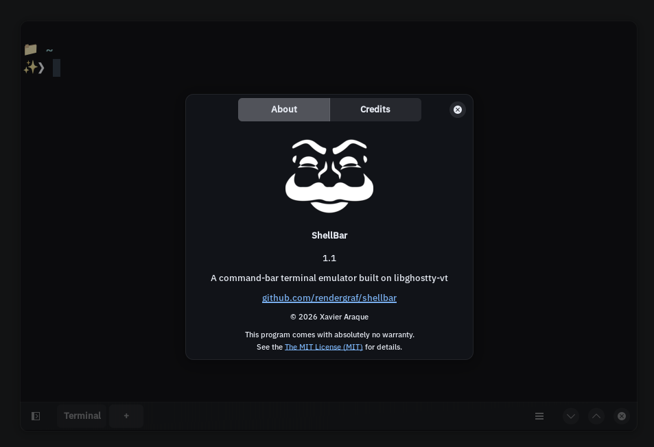
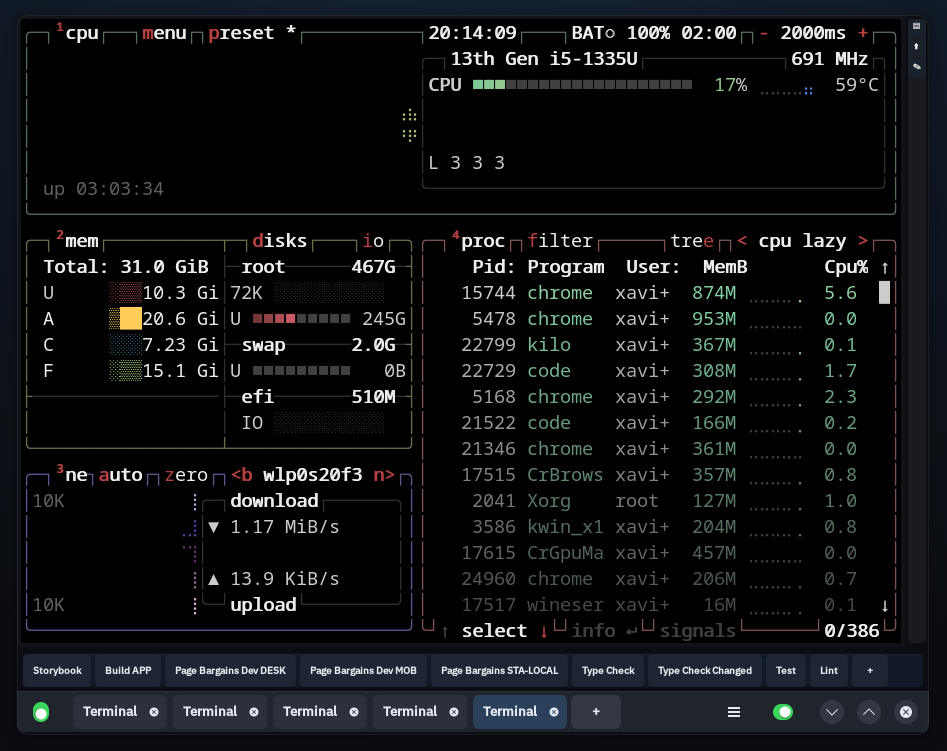

# ShellBar v1.9.0

> ShellBar is a tool designed to streamline how developers interact with their projects, especially in complex environments such as monorepos.
> ShellBar is **NOT a fork** of Ghostty. It uses `libghostty-vt` as a library via CMake FetchContent, maintaining complete independence from upstream Ghostty.

<p align="center">
  <a href="https://github.com/rendergraf/shellbar"></a>
  <a href="https://github.com/rendergraf/shellbar"></a>
  <a href="https://github.com/rendergraf/shellbar/blob/main/LICENSE"></a>
  <a href="https://rendergraf.github.io/shellbar/"></a>
  <a href="https://github.com/rendergraf/shellbar/releases/latest"></a>
  
</p>

<p align="center">
  
</p>

## Screenshots

<p align="center">
  
  
</p>
<p align="center">
  
  
</p>

## Tech Stack

<p align="center">
  
  
  
  
  
  
</p>

<p align="center">
  
  
  
  
  
  
</p>

## What is ShellBar?

A Ghostty-like terminal for Linux that adds a **programmable command toolbar**. Instead of remembering and retyping long commands across your monorepos, you configure one-click buttons.

**Concrete example:** You work on 3 monorepos. Each has commands like:
- `pnpm storybook:ds --port 3000`
- `pnpm build && pnpm test`
- `./deploy.sh staging`

In ShellBar, you add them once to `~/.config/shellbar/config`:

```ini
toolbar-button = name="Storybook", command="pnpm storybook:ds --port 3000", icon="media-playback-start"
toolbar-button = name="Build+Test", command="pnpm build && pnpm test", icon="emblem-system"
toolbar-button = name="Deploy", command="./deploy.sh staging", icon="emblem-default"
toolbar-position = "bottom"
```

They appear as clickable buttons. **One click → runs the command in the active terminal.** No more scrolling through shell history or grepping package.json.

If you love Ghostty's look and speed but want a toolbar for your daily commands, ShellBar is for you.

## Features

- Full terminal with VT100-520, 256 colors, true color, Kitty protocol support
- **Configurable toolbar** with command buttons from `~/.config/shellbar/config`
- **Visual button feedback** — toolbar buttons flash with a brief highlight on click
- **Text selection** with copy-on-select, mouse drag, double-click word, triple-click line
- **Copy / Paste** (Ctrl+Shift+C / Ctrl+Shift+V) with GTK clipboard, middle-click paste
- **Shift+Click** and **Shift+Arrow keys** extend selection
- **URL detection** with hover underline, pointer cursor, and Ctrl+Click to open
- **Search** (Ctrl+F) — inline search bar with match navigation, highlighted matches, and fade-out on click
- **Font zoom** (Ctrl+= / Ctrl+-) — resize terminal font with on-screen zoom level indicator
- **Smooth animated auto-scroll** to bottom on Enter key
- **I-beam cursor** for text selection areas
- **Drag-and-drop reorder** in Preferences dialog with embedded drag-handle icon
- **Utility bar** — auto-detects installed TUI tools (btop, htop, lazygit, etc.) and launches them in the active terminal
- **Utility bar toggle** with green tools icon when active, gray when inactive
- **Improved keyboard focus** — capture-phase key handler ensures keystrokes reach the terminal even after tab close or dialog interaction
- **Minimum terminal size** (80×24) enforced to fit tools like btop
- **Right-click context menu**: Copy, Paste, Select All
- **Configurable keybinds** in config file
- **Tabs** with `AdwTabBar` + `AdwTabView`, each with its own shell
- Dynamic tab titles (OSC 0/2 from the shell)
- Visual Ghostty clone (dark theme, GTK4/libadwaita, no window title)
- Infinite scrollback (configurable)
- Cairo + Pango rendering (anti-aliasing, unicode, font fallback)
- `key = value` config format (same as Ghostty)
- Hot-reload config via `SIGHUP`
- `Ctrl+T` shortcut for new tab
- `Alt+1`..`Alt+0` shortcuts for toolbar buttons
- **Command palette** (Ctrl+P) — search and run from shell history or PATH executables
- **Inline ghost-text autocomplete** — suggest commands from your shell history and PATH
- **Configurable button bar position**: top / bottom / left / right
- **Preferences Settings page** with button bar position selector
- **Tab transitions** — smooth slide-in animation when creating new tabs
- **Resize overlay** — shows terminal dimensions (cols × rows) on window resize
- **Button bar** can be toggled with an iOS-style switch in the bottom bar
- Wayland and X11 compatible

## Install

### Arch Linux (AUR)

```sh
yay -S shellbar
```

Or from pre-built package:

```sh
curl -LO https://github.com/rendergraf/shellbar/releases/latest/download/shellbar-1.9.0-1-x86_64.pkg.tar.zst
sudo pacman -U shellbar-1.9.0-1-x86_64.pkg.tar.zst
```

### Homebrew (Linux)

```sh
brew tap rendergraf/shellbar
brew install shellbar
```

### Flatpak (Flathub)

```sh
flatpak install flathub io.github.rendergraf.shellbar
```

### Snap Store

```sh
sudo snap install shellbar
```

### Nix / NixOS

```sh
nix-shell -p shellbar
```

### Copr (Fedora)

```sh
sudo dnf copr enable rendergraf/shellbar
sudo dnf install shellbar
```

### AppImage (portable, any distro)

Download the latest AppImage from [GitHub Releases](https://github.com/rendergraf/shellbar/releases/latest), make it executable and run:

```sh
chmod +x ShellBar-1.9.0-x86_64.AppImage
./ShellBar-1.9.0-x86_64.AppImage
```

### Fedora / RHEL (pre-built .rpm)

```sh
curl -LO https://github.com/rendergraf/shellbar/releases/latest/download/shellbar-1.9.0-1.x86_64.rpm
sudo rpm -i shellbar-1.9.0-1.x86_64.rpm
```

Or with dnf:

```sh
sudo dnf install https://github.com/rendergraf/shellbar/releases/latest/download/shellbar-1.9.0-1.x86_64.rpm
```

### Debian / Ubuntu (pre-built .deb)

```sh
curl -LO https://github.com/rendergraf/shellbar/releases/latest/download/shellbar_1.9.0_amd64.deb
sudo dpkg -i shellbar_1.9.0_amd64.deb
sudo apt-get install -f
```

### Arch Linux (pre-built package)

```sh
curl -LO https://github.com/rendergraf/shellbar/releases/latest/download/shellbar-1.9.0-1-x86_64.pkg.tar.zst
sudo pacman -U shellbar-1.9.0-1-x86_64.pkg.tar.zst
```

### Build from source

Zig (>= 0.15.2) is downloaded automatically during the build process and stored in `build/`.

```sh
git clone https://github.com/rendergraf/shellbar
cd shellbar
cmake -B build -G Ninja
cmake --build build
./build/shellbar
```

Release build: `cmake -B build -G Ninja -DCMAKE_BUILD_TYPE=Release`

### Create release packages

The `build-release.sh` script builds Debian, Arch Linux, and Fedora packages:

```sh
./build-release.sh 1.9.0               # All packages (.deb + .pkg.tar.zst + .rpm)
./build-release.sh 1.9.0 --deb-only    # Debian only
./build-release.sh 1.9.0 --arch-only   # Arch only
./build-release.sh 1.9.0 --rpm-only    # Fedora only
```

Packages are generated in `build/`:
- **Debian/Ubuntu**: `shellbar_1.9.0_amd64.deb` — install with `sudo dpkg -i`
- **Arch Linux**: `shellbar-1.9.0-1-x86_64.pkg.tar.zst` — install with `sudo pacman -U`
- **Fedora/RHEL**: `shellbar-1.9.0-1.x86_64.rpm` — install with `sudo rpm -i`

## Requirements

| Dependency | Version | Purpose |
|------------|---------|---------|
| Zig | >= 0.15.2 | Build libghostty-vt (auto-downloaded) |
| C compiler | C11 (gcc/clang) | Build ShellBar |
| CMake | >= 3.19 | Build system |
| Ninja | — | Build backend |
| GTK4 | >= 4.12 | GUI toolkit |
| libadwaita | >= 1.5 | Windows, tabs, styles |
| Pango | — | Terminal text |
| Cairo | — | Terminal rendering |
| git | — | Fetch libghostty-vt |

### Install dependencies

**Debian/Ubuntu 24.04:**

```sh
sudo apt install build-essential cmake ninja-build \
  libgtk-4-dev libadwaita-1-dev libpango1.0-dev \
  libcairo2-dev git wget
```

**Fedora 41+:**

```sh
sudo dnf install gcc cmake ninja-build gtk4-devel libadwaita-devel \
  pango-devel cairo-devel git wget
```

**Arch Linux / EndeavourOS:**

```sh
sudo pacman -S base-devel cmake ninja gtk4 libadwaita pango cairo git wget
```

## Configuration

File: `~/.config/shellbar/config`

Format: `key = value` (same as Ghostty):

```ini
# Toolbar buttons
toolbar-button = name="Storybook", command="pnpm storybook", icon="media-playback-start"
toolbar-button = name="Build", command="pnpm build", icon="emblem-system"
toolbar-button = name="Test", command="pnpm test --watch", icon="emblem-default"
toolbar-button = name="Lint", command="pnpm lint --fix", icon="emblem-important"

# Keybinds
keybind = action="copy", key="c", mods="ctrl+shift"
keybind = action="paste", key="v", mods="ctrl+shift"
keybind = action="select_all", key="a", mods="ctrl+shift"
```

If the config file doesn't exist, default buttons and keybinds are used.

### Hot reload

```sh
kill -HUP $(pidof shellbar)
```

## Interaction shortcuts

| Shortcut | Action |
|----------|--------|
| `Ctrl+T` | New tab |
| `Ctrl+F` | Search in terminal |
| `Ctrl+=` / `Ctrl+KpAdd` | Zoom font in |
| `Ctrl+-` / `Ctrl+KpSubtract` | Zoom font out |
| `Ctrl+Shift+C` | Copy selection |
| `Ctrl+Shift+V` | Paste |
| `Ctrl+Shift+A` | Select all |
| `Alt+1`..`Alt+9`, `Alt+0` | Execute toolbar buttons 1–10 |
| `Escape` | Close search bar |
| `Shift+Click` | Extend selection to clicked position |
| `Shift+←` `Shift+→` `Shift+↑` `Shift+↓` | Extend selection by one cell |
| `Ctrl+Click` on URL | Open URL in default browser |

### Mouse interactions

| Action | Result |
|--------|--------|
| Drag | Select text (top-to-bottom and bottom-to-top) |
| Double-click | Select word |
| Triple-click | Select entire line |
| Middle-click | Paste from clipboard |
| Right-click | Context menu (Copy / Paste / Select All) |
| Hover over URL | Underline highlight + pointer cursor + "Ctrl+Click" tooltip |
| Hover over text | I-beam cursor for selection |

### Keybind configuration

Keybinds are configurable via `~/.config/shellbar/config`:

```ini
keybind = action="copy", key="c", mods="ctrl+shift"
keybind = action="paste", key="v", mods="ctrl+shift"
keybind = action="select_all", key="a", mods="ctrl+shift"
```

Available actions: `copy`, `paste`, `select_all`.
Available mods: `ctrl`, `shift`, `alt`, `super` (combined with `+`).

### Tab architecture

- `AdwTabBar` is a standalone top bar inside `AdwToolbarView`, below the header — never hidden (`autohide = FALSE`)
- `AdwTabView` is the main content area
- `adw_tab_view_append()` adds each terminal widget as a page
- `adw_tab_bar_set_view()` links the bar to the view so pages sync automatically
- `"notify::selected-page"` updates the toolbar's active terminal on tab switch
- `"close-page"` destroys the terminal and removes the page
- Each tab has its own `forkpty` PTY, Ghostty VT state, and Cairo render surface

## Architecture

```
shellbar/
├── CMakeLists.txt       # Build: fetches libghostty-vt + GTK4 + Cairo/Pango
├── shellbar.c           # AdwApplication entry point
├── sb_window.c/h        # AdwApplicationWindow + AdwTabView + header
├── sb_terminal.c/h      # Terminal: PTY + libghostty-vt + Cairo render + input
├── sb_toolbar.c/h       # Toolbar with command buttons
├── sb_config.c/h        # Config key=value from ~/.config/shellbar/config
├── sb_preferences_dialog.c/h # Preferences dialog for editing buttons
└── README.md            # This file
```

### Keyboard flow

1. `GtkEventControllerKey` on `AdwToolbarView` (capture phase) catches all keys
2. `Ctrl+T` → new tab; `Alt+1..0` → toolbar shortcuts
3. Remaining keys are forwarded to `sb_terminal_handle_key()`
4. Configurable keybinds are checked first (copy, paste, select_all)
5. If the key maps to a Ghostty key (`gdk_keyval_to_ghostty`):
   - `ghostty_key_encoder_encode()` produces the escape sequence
   - The result is written to the PTY
6. If the key does **not** map (symbols like `*`, `!`, `ñ`, `ü`):
   - UTF-8 text is written directly to the PTY via `gdk_keyval_to_unicode()`
7. If the Ghostty encoder produces no output but UTF-8 text is available,
   the text is written directly (fallback)

This approach guarantees compatibility with all keyboard characters
while using the Ghostty encoder for control keys, function keys, and
modifier sequences.

## Author

**Xavier Araque** — xavieraraque@gmail.com — May 2026

## License

MIT © 2026 Xavier Araque

## Acknowledgments

- [Ghostty](https://github.com/ghostty-org/ghostty) — VT engine and reference
- [Ghostling](https://github.com/ghostty-org/ghostling) — architectural inspiration
